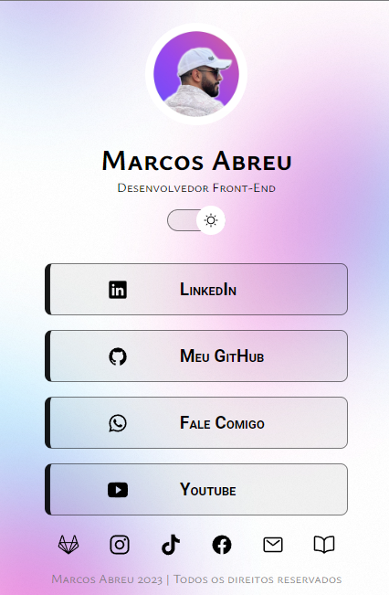

<h1 align="center">Marcos Abreu - Links</h1>

 

  
  

## 🚀 Tecnologias

Esse projeto foi desenvolvido com as seguintes tecnologias:

- HTML e CSS
- JavaScript
- Vite, ESlint
- Node e NPM
- Git e Github

- [Acesse o projeto finalizado, online](https://https://omarcossabreu.github.io/projeto-Links/)

## :memo: Licença

Esse projeto está sob a licença MIT.